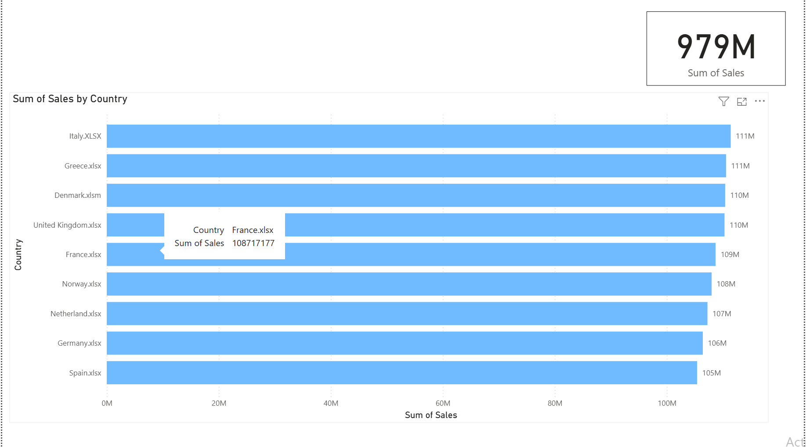
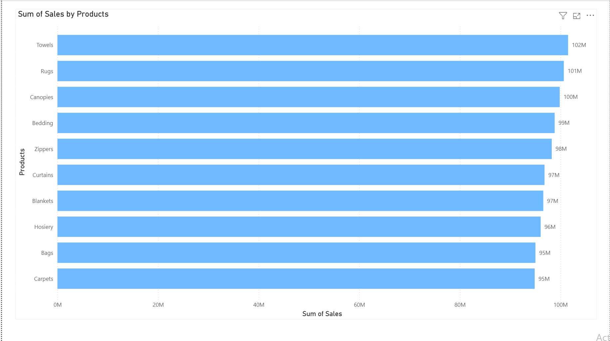
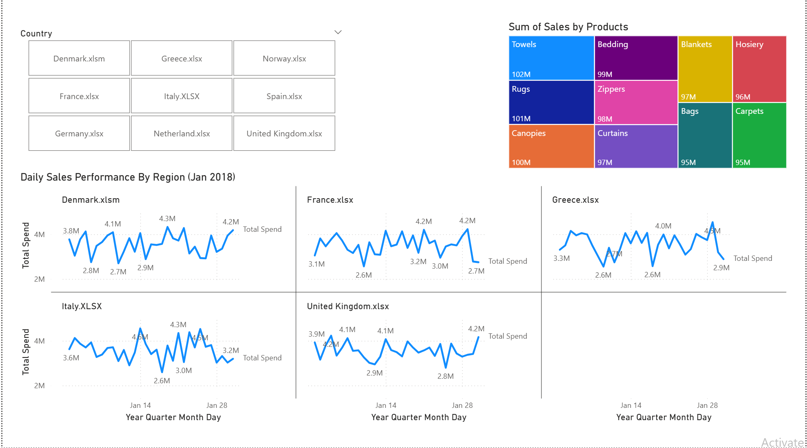

# EU Sales Operations Analysis (Jan 2018)

## 📌 Project Overview
This project focuses on the consolidation and analysis of daily sales performance across 10 distinct European markets. The goal was to transform disparate raw data sources into a unified, interactive dashboard that identifies growth trends, operational bottlenecks, and regional performance benchmarks.

**Key Objective:** To demonstrate how technical data modeling can provide actionable insights for resource scheduling, job costing, and multi-region business operations.

## 🚀 Key Features & Insights
* **Data Consolidation (ETL):** Engineered a robust data pipeline in Power Query to append 10+ regional CSV and Excel files into a single "Source of Truth."
* **Small Multiples Visualization:** Implemented a "Small Multiples" layout to compare 10 countries side-by-side without visual clutter, allowing for instant regional benchmarking.
* **Trend Identification:** Integrated automated trend lines to filter out daily "noise" (volatility) and highlight the true growth trajectory for the month of January.
* **Executive Formatting:** Optimized the X-axis for readability and used a shared Y-axis to ensure an honest scale comparison across high-performing (Germany/Italy) and lower-volume markets.

## 🛠️ Tools Used
* **Power BI:** Dashboard Design, DAX (Data Analysis Expressions), and Analytics.
* **Power Query:** Data Cleaning, Table Appending, and Transformation.
* **Microsoft Excel:** Source data management for regional sales.

## 📂 Repository Structure
* `/Data`: Contains the raw regional sales files (France, Germany, UK, etc.).
* `/Report`: The `.pbix` Power BI project file.
* `/Screenshots`: High-resolution captures of the final dashboard for quick viewing.

## 📊 Dashboard Previews

  
<b>Click here to view all 4 Dashboard Pages</b>

   

  ### Page 1: Sales Summary
  *High-level overview of total sales by country.*
  

  
  ### Page 2: Product Summary
  *Analysis of top-performing categories and inventory turnover.*
  
  
  ### Page 3: Sales Overview (Small Multiples)
  *Daily sales trajectories across 10 markets using shared-axis comparisons.*
  
  
  
  ### Page 4: Data Validation & Operations
  *Backend view of the data model and quality checks ensuring 100% accuracy.*
  

---
**Author:** Sumaiya Mahmood Khan  
**Background:** Electrical Engineering | Data Science & AI
